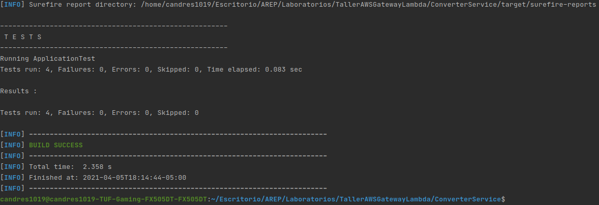

# Taller Amazon Gateway y Lambda

Aplicativo web que transforma de grados Fahrenheit a celsius, el cual la parte abierta al usuario fue desplegada en el
servicio de archivos estáticos S3 de AWS, y la capa lógica fue puesta en un contenedor Docker y desplegada en el
servicio EC2, esto debido a la arquitectura dada del proyecto.

## Información Del Proyecto

* La documentación del las clases y los métodos del proyecto se encuentran en el directorio adjunto /Javadoc/apidocs.

### Pre-Requisitos

Para correr este proyecto necesita los siguientes programas instalados, se adjuntan los links de como descargarlos:

> * [Como Instalar Java 8](https://www.oracle.com/co/java/technologies/javase/javase-jdk8-downloads.html)
> * [Como Instalar Apache Maven](http://maven.apache.org/download.html#Installation)
> * [Como Instalar Docker](https://docs.docker.com/engine/install/)

Adicionalmente se recomienda tener descargado los siguientes programas:

> * [Como Instalar Git](http://git-scm.com/book/en/v2/Getting-Started-Installing-Git)

### Video del despliegue y funcionamiento en AWS

[](https://www.youtube.com/watch?v=xQPOAP5QU44)

### Arquitectura

La arquitectura del aplicativo se basa en el siguiente modelo:


La arquitectura de este archivo se basa en la comunicación entre servicios de AWS los cuales son S3, APi GateWay y EC2,
en los cuales se tienen un servicio public que será el encargado de ser mostrado al usuario y de mostrar los resultados
de una manera amigable, el segundo el cual hara de comunicador entre el servicio 1 y 3 y finalmente él ultimó servicio
en el cual hay contenedor Docker corriendo con el framework Spark y la capa lógica de conversion entre grados.

### Instalación Capa Lógica

Nota: Si desea simplemente descargar el contenedor con la ultima version modificada y subida a Dockerhub haga
click [aquí](https://hub.docker.com/repository/docker/candres1019/degreesservicedocker) para ir a la imagen.

* Si va a usar la imagen del proyecto desplegada en DockerHub solamente debe ejecutar el siguiente comando:

  > ```
  > docker run -d -p 42001:6000 --name {CualquierNombre} candres1019/degreesservicedocker
  > ```


1. Clonación del Proyecto:

   Nota: Él UI del proyecto se encuentra en el directorio /StaticWebpage

    * Para **Clonar** el proyecto utilice el siguiente comando en la ventana de comandos:

   > ```
   > https://github.com/Candres1019/TallerAmazonGatewayLambda.git
   > ```

2. En una ventana de comandos ejecuté el siguiente comando, dentro del directorio /ConverterService.

   > ```
    > mvn package
    > ```


3. Para ejecutar la aplicación de manera local utilizamos en la ventana de comando los siguientes comandos dentro del
   directorio "/ConverterService":

   > ```
    > docker build --tag {cualquiernombre} .
    > docker run -d -p 42001:6000 --name {cualquiernombrediferente} {cualquiernombre}
    > ```


4. Para verificar que todo esté funcionando de manera correcta ejecutamos el siguiente comando:

   > ```
    > docker ps
    > ```

5. Para utilizar la API debe acceder al siguiente path si fue utilizado de manera local, de lo contrario utilice el
   asignado por su servidor.

   > ```
    > http://localhost:42001/convert/fahrenheit/celsius?value={numero}
    > ```

## Generación de Documentación

Por defecto se creó la documentación JavaDoc y fue dejada en el directorio /Javadoc, si desea generar uno nuevo utilice
el siguiente comando, esta documentación quedará en el directorio /target/site/apidocs :

> ```
   > mvn javadoc:javadoc
   > ```

## Ejecución de pruebas

En una ventana de comandos, utilice el siguiente comando:

   ```
    mvn test
   ```

> Reporte de Pruebas:
>
> 

## Construido Con

* [Java](https://www.java.com/es/) - Lenguaje de Programación.
* [JUnit](https://junit.org/junit5/) - Pruebas de Unidad.
* [Maven](https://maven.apache.org/) - Manejo de dependencias.
* [IntelliJ IDEA](https://www.jetbrains.com/es-es/idea/) - Entorno de Desarrollo.
* [AWS](https://aws.amazon.com/es/) - Despliegue en la nube.

## Authors

* **Andres Mateo Calderón Ortega** - [Candres1019](https://github.com/Candres1019)

# Licencia

Este proyecto está licenciado bajo el GNU v3.0 - ver el archivo [LICENSE](./LICENSE) para más detalles.
